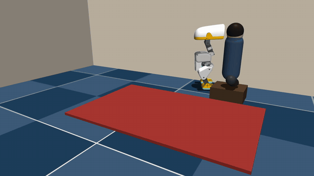
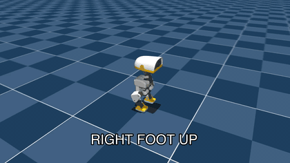

# microduck-courier

[](https://github.com/selinayfilizp/microduck-courier/actions/workflows/ci.yml)

One-day physical-AI project, now with a second day: teach a
[Microduck](https://pollen-robotics.com/microduck/) to deliver *The Courage to
Be Disliked* across a tiny apartment.

Pick → carry → place. Reward the delivery, not looking cute.



*First episode of the real trained rollout: stumble at 0.6 s, recovery, grasp at 2.9 s, delivery at the reader's feet at 6.0 s. The full 20-second clip and its telemetry are in [Release artifacts](#release-artifacts).*

Clone: `git clone https://github.com/selinayfilizp/microduck-courier.git`

Other agents: read `AGENTS.md` first. This repo is the source of truth (Pollen's
RL stack is vendored under `microduck_rl/`, not a nested clone).

## What's here

- `microduck_rl/`: Pollen's RL stack, plus two courier tasks:
  `Mjlab-Courier-Flat-MicroDuck` (v1, the trained one) and
  `Mjlab-Courier-Wide-MicroDuck` (v2, see below)
- `microduck_rl/src/mjlab_microduck/robot/microduck/scene_apartment.xml`: floor, rug, paperback, seated reader
- `artifacts/`: verified trained-policy clip, telemetry, and the deployable ONNX
- `DEPLOYMENT.md`: how this maps onto the real robot (perception bridge, runtime, prop book)
- `policies/`: created by `scripts/fetch_policies.sh`, holds Pollen's stock
  walking/standing ONNX brains (gitignored, downloaded on demand)

This Mac has an M4, not CUDA. Walking in the viewer is CPU MuJoCo. Training
needs a GPU; use Hugging Face Jobs.

Install [uv](https://docs.astral.sh/uv/) once (`brew install uv` or see their
docs) before the walking / train commands.

## 1. Reproduce the headline claim in one command

The deployment export `artifacts/courier-policy.onnx` (61 floats in, 14 floats
out, observation normalizer baked in) is committed, and it is evaluable without
the training checkpoint:

```bash
cd microduck_rl
uv run python scripts/evaluate_courier_policy.py \
  --onnx ../artifacts/courier-policy.onnx \
  --num-envs 32 --seconds 20 --seed 1042 --require-success
```

On CPU, with play-mode perturbations enabled, this reproduces the eval the
README has always claimed: 32/32 rollouts deliver, zero failed episodes
(verified 2026-08-30, `delivery_rate: 1.0`, mean first delivery 6.5 s). The
result JSON carries provenance: timestamp, git commit, and the SHA-256 of the
exact policy file.

CI runs the same rollout at smaller scale on every push (`policy-proof` job:
8 envs, same seed, same environment) and fails the build unless every episode
delivers. The badge above is not "the linter passed"; it is "the duck still
delivers the book".

## 2. Duck in the apartment (interactive)

```bash
cd microduck_rl
python3 scripts/view_apartment.py          # macOS re-launches under mjpython
```

Hold STAND. Drag the camera. Esc to quit.

Walk it with the official gait (arrow keys in the terminal, not the viewer):

```bash
./play_apartment.sh
```

`G` triggers ground-pick (beak to the floor, the pick half of the job).

## 3. The trained v1 policy

The selected L4 checkpoint is `model_750.pt` from the private Hugging Face
model repo `selinayfilizp/mjlab-courier-flat-microduck-20260828-134647` (the
ONNX export committed in this repo is the public artifact). The paid job was
stopped after this checkpoint passed the full task, instead of spending the
remaining budget.

Strict CPU evaluation with play-mode perturbations enabled produced:

- 16/16 deliveries over 8-second rollouts with seed 42.
- 32/32 deliveries over 20-second rollouts with seed 1042 (reproducible from
  the committed ONNX, see section 1).
- Zero failed episodes and zero NaN terminations in the 32-rollout check.

Honest scope note: v1 is a narrow task. The book always spawns about 16 cm
straight ahead and the reader about 55 cm straight ahead, with centimeter
noise. That is exactly why v2 exists.

## 4. The wide task (v2): from scripted trick toward a real courier

`Mjlab-Courier-Wide-MicroDuck` keeps v1 byte-identical and changes the task
around it:

- **Polar spawn distribution with a curriculum**: book 12-35 cm away at up to
  ±60° bearing, reader 40-90 cm at up to ±90°, widened in three stages so the
  policy consolidates before the distribution hardens. Play/eval always runs
  the full target distribution.
- **State-gated phases** (`CourierPhaseCommand`): wall time can no longer push
  an episode past a boundary it has not earned. Pick holds until the grasp
  latch closes; carry holds until the grasped book is near the reader; the
  episode timeout stays the fallback. Same cos/sin encoding, so the 61-D obs
  contract is untouched.
- **Settle-checked delivery**: released near the reader is not enough. The
  free book must rest on the floor, inside the place radius, below a speed
  threshold, for 5 consecutive steps. A drop that bounces away never counts.
- **Object-level DR**: book mass 0.6-1.4x, cover friction, and spawn yaw are
  randomized. The manipulated object stops being a single constant.
- **Perception-style noise** (±2 cm) and 0-2 step delay on the actor's book
  and reader observations, so a real camera + ToF bridge with honest error is
  inside the training distribution. The critic keeps clean privileged copies.
- **Servo-gain DR** (KP/KD scale), a classic XL330 sim2real axis that v1's
  flags declared but never wired.
- Episodes are 14 s to leave room for the longer routes.
- **Time-budgeted pick shaping**: because the gated clock can hold the pick
  segment open indefinitely, an unbounded per-step proximity Gaussian would
  make hovering next to the book the optimal policy. The wide task pays the
  Gaussian only inside a 5 s wall-clock budget and pays the grasp latch as a
  salient one-shot bonus. (Both halves matter: a first wide run using pure
  potential-based shaping produced a policy that approached the book but
  essentially never latched, because nothing paid for staying in the latch
  basin.)

Evaluate a wide checkpoint with
`--task Mjlab-Courier-Wide-MicroDuck` (the horizon then defaults to the 14 s
episode; anything shorter can never observe a delivery in this task).

### v2 results (trained 2026-08-30, L4 on HF Jobs)

Strict CPU eval on the FULL wide distribution (books 12-35 cm at ±60°,
readers 40-90 cm at ±90°, all DR active, settle-checked delivery), 28 s
rollouts, from the committed `artifacts/courier-wide-policy.onnx`:

- Seed 1042: 32/32 grasps, 32/32 deliveries, mean first delivery 13.0 s.
- Seed 42: 32/32 grasps, 31/32 deliveries, mean first delivery 13.1 s.
- Honest trade: roughly one episode in six ends in a fall along the way
  (12 and 11 failed episodes out of 64 per seed); the policy usually stands
  back up or retries in the next episode, which is how both seeds still
  deliver in 63/64 rollout envs. An earlier 4000-iteration policy scored
  27-28/32 with zero falls; delivery coverage won the artifact slot.

The committed policy is the 1250-iteration checkpoint of a run that trained
on the FIXED phase dynamics and was cut short mid-curriculum; even partial,
it beats the full 4000-iteration run that trained against the phase bug
below. Getting here took four GPU runs and two verified bug fixes, all
documented because they are the actual lesson:

1. Pure potential-based pick shaping trained a policy that approached the
   book but never latched (see the shaping bullet above).
2. The phase gate originally PULLED PROGRESS BACK while the duck oscillated
   around the handoff radius, so a policy carrying the book to within 1 cm
   of the reader could never enter the place segment. A one-line hold-at-max
   fix took that same checkpoint from 0/16 to 29/32, and retraining on the
   fixed dynamics reached full delivery coverage in a third of the
   iterations.

CI rolls out the wide ONNX too (`wide-policy-proof`, 6/8 gate).

### Train it

```bash
cd microduck_rl && uv run hf auth login   # once
cd .. && ./scripts/train_courier_hf.sh
```

The script now runs a free CPU wiring smoke test before submitting the paid
job (set `COURIER_SKIP_SMOKE=1` to skip), defaults to the wide task
(`COURIER_TASK=Mjlab-Courier-Flat-MicroDuck` for v1), and takes
`COURIER_HF_FLAVOR`, `COURIER_HF_TIMEOUT`, `COURIER_ITERS` overrides.

Watch `Episode_Reward/place_success` and `Episode_Reward/carry_progress`.
Every `Episode_Reward/*penalty*` must stay ≤ 0.

The training reward pays `grasp_edge` and `place_success` once per event;
neither can be farmed by holding a pose. Carry progress is paid only while
upright, a non-delivery termination costs 500, and delivery pays 250 once.
The actor remains 61-D: its head-command slot is book xyz + grasp flag, and
its body-command slot is reader xyz + padding. A real deployment must populate
those slots from perception; `DEPLOYMENT.md` maps that bridge.

## 5. Recording clips

Record a real policy rollout (checkpoint or committed ONNX) and reject
unsuccessful or visually incomplete seeds automatically:

```bash
cd microduck_rl
uv run python scripts/record_courier_policy.py \
  --onnx ../artifacts/courier-policy.onnx \
  --output ../clips/courier-policy.mp4 --seconds 20 --seed 14 \
  --track --require-success --require-stumble-recovery
```

`--track` follows the trunk instead of filming from a fixed world point, so
play-mode respawn headings stay in frame for the whole clip (the original
fixed-camera clip loses episodes 2-3 out of frame; that flaw is why this flag
exists). The recorder uses the actual mjlab environment and policy
observations and emits a JSON sidecar with grasp, stumble, recovery, and
delivery times plus provenance (timestamp, git commit, policy SHA-256).

The 8-second single-episode cut for posting comes from the 20-second clip
(same `microduck_rl` working directory as the record command):

```bash
ffmpeg -i ../clips/courier-policy.mp4 -t 8 -c copy ../clips/courier-episode1-8s.mp4
```

A deterministic scripted storyboard also exists
(`scripts/view_apartment.py --demo`, explicitly watermarked); publish only
real rollouts with their sidecars.


## 6. The duck dances: Toosie Slide

`Mjlab-Tracking-Flat-MicroDuck` ports mjlab's BeyondMimic-style motion
imitation to the duck, and the first choreography is the Toosie Slide
(82 BPM, one bar per cycle: right foot up, left foot slide, left foot up,
right foot slide, head bobs on every beat). The reference motion is authored
on a beat grid and validated kinematically for $0 before training
([ducktok](https://github.com/selinayfilizp/ducktok) is the standalone
compiler); training took about an hour on one L4.



Result, measured over 18 s of full-physics rollout (DR active): mean tracked
body error 18.6 mm, p95 36.8 mm, zero falls
([telemetry](artifacts/toosie-slide.json)).

- [Clean dance clip](artifacts/toosie-slide.mp4)
- [Step-captioned cut](artifacts/toosie-slide-steps.mp4) (lyric instructions burned in on the beat grid)
- [Ghost cut](artifacts/toosie-slide-ghost.mp4) (translucent reference overlay: watch the policy track its choreography)
- [Dance policy ONNX](artifacts/toosie-slide-policy.onnx)

Pipeline: `scripts/author_toosie_reference.py` (or a ducktok YAML) makes the
keyframe CSV, `scripts/motion_csv_to_npz.py` replays it through the real
model (npz + ghost video + per-beat feasibility report), train with
`COURIER_TASK=Mjlab-Tracking-Flat-MicroDuck ./scripts/train_courier_hf.sh`,
film with `scripts/record_tracking_policy.py`. Music goes on in post: the
clip starts on a downbeat at 82 BPM, one bar per 2.93 s.

## Release artifacts

- [20-second trained-policy rollout](artifacts/courier-policy.mp4) (fixed camera, the composed episode-one shot)
- [20-second tracking-camera rollout](artifacts/courier-policy-track.mp4) (same seed 14, recorded from the committed ONNX, every episode stays in frame: deliveries at 6.0 s and 14.0 s, third grasp at 19.0 s)
- [Rollout telemetry](artifacts/courier-policy.json) and [tracked-rollout telemetry](artifacts/courier-policy-track.json)
- [61-input, 14-action ONNX policy](artifacts/courier-policy.onnx)
- [ONNX eval result with provenance](artifacts/courier-policy.eval.json)
- [v2 wide-task ONNX policy](artifacts/courier-wide-policy.onnx) with its
  [full-distribution eval](artifacts/courier-wide-policy.eval.json), plus the
  [14-second single-episode wide rollout](artifacts/courier-wide-policy.mp4)
  and [telemetry](artifacts/courier-wide-policy.json)

The video is a real policy rollout, not the scripted storyboard. The training
checkpoint lives on Hugging Face; the ONNX deployment export is committed here
so a fresh clone contains the usable policy, and CI proves it still works.

## License

Apache-2.0 (see `LICENSE`). The vendored `microduck_rl/` tree keeps its own
Apache-2.0 license from Pollen Robotics.
